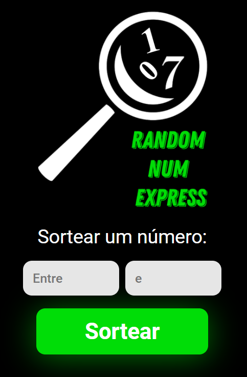

<h1> RANDOM NUM EXPRESS </h1>
 
<h2>Descrição:</h2>
 

Este projeto consiste em uma aplicação simples para realizar sorteios de números. Ele utiliza as seguintes tecnologias: JavaScript para a lógica do sorteio, HTML para a estrutura da página e CSS para o estilo.

 
<h2>Tecnologias Utilizadas:</h2>

- JavaScript

- HTML
  
- CSS
  
 

<h2>Visualização do Projeto:</h2>

 
<h2>Instruções de Uso:</h2>
<ol>
  <li>Abra o arquivo <a href="https://davialexandreh.github.io/Random-Num-Express/"> clicando aqui.</a></li>
  <li>Insira os parâmetros desejados para o sorteio.</li>
  <li>Clique no botão para gerar o número sorteado.</li>
  <li>Visualize o resultado na tela.</li>
  <li>Atualize a página para um novo sorteio.</li>
</ol>

